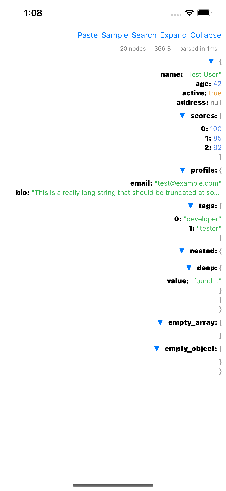

# Pry

A fast, native JSON viewer built with the [Perry](https://github.com/nicklasxyz/perry) framework.

Perry compiles TypeScript to native binaries — no Electron, no browser, no runtime. The app uses Perry's UI bindings which map directly to platform-native widgets (AppKit on macOS, GTK4 on Linux, Win32 on Windows, UIKit on iOS, Android Views on Android).



## Download

[](https://apps.apple.com/us/app/pry-json-viewer/id6759329040)
[](https://play.google.com/store/apps/details?id=com.perry.pry)

## Features

- Tree view with expand/collapse for objects and arrays
- Full-text search across keys and values
- Keyboard shortcuts (Cmd/Ctrl+O open, Cmd/Ctrl+F search, Cmd/Ctrl+E expand all)
- Copy values, keys, or JSONPath to clipboard via context menu
- Status bar with node count, file size, and parse time

## Platforms

- **macOS** — native AppKit (`src/main.ts`) — [App Store](https://apps.apple.com/app/pry-json-viewer/id6759329040)
- **Linux** — native GTK4 (`src/main_linux.ts`)
- **Windows** — native Win32 (`src/main_windows.ts`) — signing coming soon
- **iOS** — native UIKit (`src/main_ios.ts`) — [App Store](https://apps.apple.com/us/app/pry-json-viewer/id6759329040)
- **Android** — native Android Views (`src/main_android.ts`) — [Google Play](https://play.google.com/store/apps/details?id=com.perry.pry)

## Building

Pry is compiled by the Perry compiler. You need the [perry](https://github.com/nicklasxyz/perry) repo cloned as a sibling directory.

```bash
# macOS
cd /path/to/perry && cargo run --release -- compile /path/to/perry-pry/src/main.ts -o /path/to/perry-pry/pry
./pry

# Linux (requires gtk4-devel)
cd /path/to/perry && cargo run --release -- compile /path/to/perry-pry/src/main_linux.ts -o /path/to/perry-pry/pry
./pry

# Windows
cd /path/to/perry && cargo run --release -- compile /path/to/perry-pry/src/main_windows.ts --target windows -o /path/to/perry-pry/pry.exe
./pry.exe

# iOS Simulator
cd /path/to/perry && cargo run --release -- compile /path/to/perry-pry/src/main_ios.ts -o /path/to/perry-pry/pry-ios --target ios-simulator

# Android
cd /path/to/perry && cargo run --release -- compile /path/to/perry-pry/src/main_android.ts --target android -o /path/to/perry-pry/android/app/src/main/jniLibs/arm64-v8a/libpry.so
cd /path/to/perry-pry/android && ./gradlew installDebug
```

## Project Structure

```
src/                 # TypeScript source (4 entry points + 11 shared modules)
android/             # Android Studio project
xcode/               # Xcode project for iOS/macOS App Store builds
test-data/           # Sample JSON files
screenshots/         # App screenshots by platform
```

## License

MIT License. See [LICENSE](LICENSE) for details.
